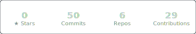

# sysatticus

**terminal-first tools for people who'd rather type than click**

---

### what i build

cli tools, dev utilities, and automation that lives in the terminal. if it doesn't pipe, it doesn't ship.

### stack

### repos

### stats

### philosophy

- if it needs a gui, ask yourself if it really needs a gui
- pipe everything
- automating > repeating
- ship early, iterate in the open

---

kyoto · jst · building in the open

